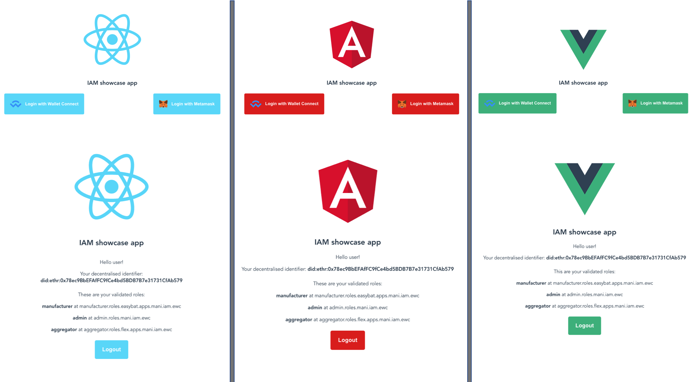

# Identity and Access Management (IAM) Client Examples

This repository contains client examples which leverage the [iam-client-lib](https://github.com/energywebfoundation/iam-client-lib) and communicate with a [hosted backend](server/express) to authenticate and authorize a user using DIDs (Decentralized Identifiers) and VCs (Verifiable Credentials).

##



## Hosted Examples

[ React Demo](https://did-auth-demo.energyweb.org/react-example/) / [ Angular Demo](https://did-auth-demo.energyweb.org/angular-example/) / [ Vue Demo](https://did-auth-demo.energyweb.org/vue-example/)

## Tutorial
This tutorial demonstrates the use of a web client to authenticate to a server using Decentralized Identifiers (DIDs) and Verifiable Credentials (VCs).

### 0. Prerequisites
- Complete general [example prequisites](prerequisites) 
- Access to a wallet account whose Volta DID Document has a role claim (corresponding to a Switchboard role)

### 1. Run the client application
1. Navigate to the React client example: `cd client/react-dapp`
2. Edit the backend url in `src/config.ts` to `http://localhost:3333`
3. Install the dependencies: `npm install`
4. Start the React client: `npm run start`. This should start the React client at `http://localhost:3000`

#### 2. Setup the server application
1. In a new shell, navigate to the Express server example: `cd server/express`
2. Install the dependencies: `npm install`
3. Start the Express server: `npm run start`. This should start the Express app at `http://localhost:3333`

#### 3. Login using wallet account
1. Navigate to `http://localhost:3000` and log in using MetaMask or WalletConnect. The Switchboard role claims of your wallet account should be displayed.

#### 4. Configure server to check for a role which your wallet account does not have
1. Stop the Express server
2. Set the ACCEPTED_ROLES to a role which your wallet account does not have: `export ACCEPTED_ROLES=wrongrole.roles.energyweb.iam.ewc`
3. Start Express server.
4. Navigate to the React app, which should be still be running. When trying to log in, an error/unauthorized message should be displayed.

#### 5. Configure server to check for a role which you wallet account has
1. Stop the Express server
2. Set the ACCEPTED_ROLES to a role which your wallet account has: `export ACCEPTED_ROLES=<Fill in your role>`
3. Start Express server.
4. Navigate to the React app, which should be still be running. When logging in, the roles of your account should again be displayed.


## Running the examples

### Prerequisites
- Make sure to have Node.js (>= v14) installed.
- Clone this Git repository.

### Running the client examples

#### Configuration
The client examples can be configured by editing their configuration files:
- React configuration file is at `client/react-dapp/src/config.ts`
- Vue configuration file is at `client/vue-dapp/src/config.ts`
- Angular configuration file is at `client/angular-dapp/src/environments/environment.ts`

The following properties can be configured:
- `backendUrl`: This is the URL of the authentication provider server application. The client examples are configured by default to communicate with a hosted backend.
- `enrolmentUrl`: Optional. If set, an enrolment link will be provided to users. If not set, no enrolment link is shown to users.

#### Running
To run the client examples, please follow below steps:

1. Navigate to the app that you want to run: `cd client/angular-dapp` or `cd client/react-dapp` or `cd client/vue-dapp`
2. Install dependencies: `npm install`
3. Run application: `npm start`

## Running the server examples

#### Configuration
The server examples can be configured via environment variables:
- `ACCEPTED_ROLES`: Optional. A list of comma separated role claims. Example: "user.roles.flex.apps.energyweb.iam.ewc,admin.roles.flex.apps.energyweb.iam.ewc".
A user must have at least one of the listed roles. If not provided, role claims are verified but no check for a specific role is performed.

***

>### **💡  How to construct the `payload` to send to the backend for login**
In order to authenticate with passport-did-auth, the data payload has to be an object formated the following way :

```javascript
 {
   identityToken: <YourToken>  
 }
``` 
By default, the key of the token has to be `identityToken` in order for your claim to be correctly parsed on login. If you'd like to change this label, on your backend, make sure to set the `claimField` field of your [loginStrategy]() accordingly when you create and [configue your loginStrategy](https://github.com/energywebfoundation/passport-did-auth/blob/develop/docs/guides/authExpress.md). For example, if you want to call this field `myIdentityTokenField` instead of `identityToken` you have to:
* format your payload :

```javaScript
{
  myIdentityTokenField: <YourToken>
}
```
* set your loginStrategy

```javascript
//set the claimField param to your field's name
const loginStrategyOption = {
  claimField: 'myIdentityTokenField',
  jwtSecret: 'secret',
  name: 'login',
  rpcUrl: 'https://volta-rpc.energyweb.org/v1',
  cacheServerUrl: 'http://13.52.78.249:3333/',
}

passport.use(new LoginStrategy(loginStrategyOption));
```

`<YourToken>` refers to the proof token you can get from various ways depnding on your usecase. You can either:

<details>
    <summary>Manually generate your token</summary>

     You may want to generate your claim token manually. You can refer to the example demonstrated in the jwt-login example, in which the function `generate-identity` shows how this token generation is made.
</details>
or
<details>
    <summary>Use iam-client-lib</summary>
    
    iam-client-lib contains some functions that can be used to get a proof token  `createIdentityProof`, `createPublicClaim `
</details>

***

## License

This project is licensed under the GNU General Public License v3.0 or later - see the [LICENSE](LICENSE) file for details

## FAQ

Frequently asked questions and their answers will be collected here.
